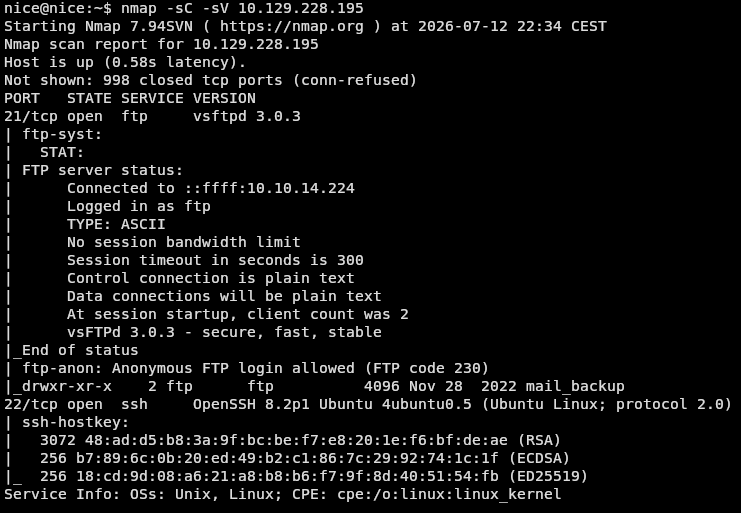
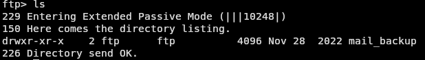

# Funnel - HackTheBox 
## Very easy

IP : 10.129.228.195

### The beginning of the challenge

To begin this challenge, I started by doing a scan with **nmap**
`
nmap -sC -sV 10.129.228.195
`
- sC = Default enumerations scripts
- sV = Version detection

I found that this IP is related to two services : FTP and SSH.

 

On the screenshot, we can see that the ftp anon login are allowed, so I directly try to connect as an **anonymous** user to see what the server has.

 

I see that there is a folder named **mail_backup**, and when I get into this, I find two files named 

- **password_policy.pdf**
- **welcome_28112022**

/WIP/
